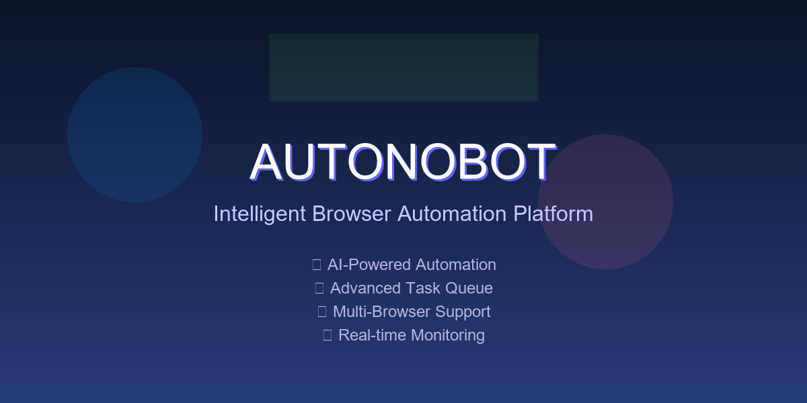

<div align="center">

# 🤖 AUTONOBOT
### *Next-Generation Intelligent Browser Automation Platform*



[](https://python.org)
[](LICENSE)
[]()
[]()

*Revolutionizing web automation through advanced AI-driven browser control with enterprise-grade reliability and seamless task orchestration.*

</div>

---

## 🚀 **What is AUTONOBOT?**

AUTONOBOT is a cutting-edge intelligent browser automation platform that combines the power of Large Language Models (LLMs) with robust browser control capabilities. Built for professionals, developers, and businesses who demand reliable, scalable, and intelligent web automation solutions.

### 🎯 **Core Value Proposition**

- **🧠 AI-First Approach**: Natural language task execution with advanced reasoning
- **🔄 Enterprise Reliability**: Production-ready with comprehensive error handling
- **⚡ Seamless Workflow**: Intuitive interface with powerful task management
- **🌐 Universal Compatibility**: Works with any website, any browser, any task
- **🛡️ Robust Architecture**: Built for stability, scalability, and continuous operation

---

## ✨ **Key Features & Capabilities**

### 🎛️ **Advanced Task Queue System**
- **Multi-Task Orchestration**: Execute complex workflows with intelligent task sequencing
- **Real-Time Monitoring**: Live status tracking with detailed execution logs
- **Priority Management**: Dynamic task reordering and execution control
- **Persistent Sessions**: Maintain browser context across multiple operations
- **Auto-Recovery**: Intelligent error detection and automatic retry mechanisms

### 🔧 **LLM Configuration Synchronization**
- **🔧 Update Config Button**: One-click synchronization across all system components
- **Multi-Provider Support**: Seamless integration with Gemini, OpenAI, Anthropic, DeepSeek, Ollama
- **Configuration Validation**: Real-time verification of API keys and model availability
- **Unified Settings**: Centralized configuration management for consistent behavior

### 🌐 **Enhanced Browser Management**
- **Persistent Browser Sessions**: Maintain state and history across tasks
- **Custom Browser Integration**: Use your existing browser with saved logins and preferences
- **High-Definition Recording**: Capture and review all automation activities
- **Multi-Resolution Support**: Adaptive display settings for optimal performance
- **Connection Stability**: Robust error handling with automatic reconnection

---

## 🛠️ **Installation & Setup**

### 📋 **Prerequisites**

- **Python 3.11+** (Required for local installation)
- **Docker & Docker Compose** (For containerized deployment)
- **Git** (For repository cloning)

### 🚀 **Quick Start - Automated Installation**

AUTONOBOT includes an automated installation script for seamless setup:

```bash
# Clone the repository
git clone https://github.com/josedcape/AUTONOBOT.git
cd AUTONOBOT

# Run automated installation script
./install.sh  # Linux/Mac
# or
install.bat   # Windows

# Start AUTONOBOT
python webui.py
```

### 🐳 **Docker Deployment (Recommended)**

**Production-ready containerized deployment with full isolation:**

```bash
# Clone and setup
git clone https://github.com/josedcape/AUTONOBOT.git
cd AUTONOBOT

# Configure environment
cp .env.example .env
# Edit .env with your API keys and preferences

# Deploy with persistent browser sessions
CHROME_PERSISTENT_SESSION=true docker compose up -d

# Access the platform
# WebUI: http://localhost:7788
# VNC Viewer: http://localhost:6080/vnc.html
```

### 💻 **Local Development Setup**

**For developers and advanced users:**

```bash
# Setup Python environment
uv venv --python 3.11
source .venv/bin/activate  # Linux/Mac
# .venv\Scripts\activate   # Windows

# Install dependencies
uv pip install -r requirements.txt
playwright install

# Configure environment
cp .env.example .env
# Add your LLM API keys

# Launch development server
python webui.py --ip 127.0.0.1 --port 7788
```

---

## 🎯 **Getting Started Guide**

### 🔧 **Essential Configuration**

1. **Configure Your LLM Provider:**
   ```bash
   # Edit your .env file
   OPENAI_API_KEY=your_openai_key_here
   GOOGLE_API_KEY=your_gemini_key_here
   ANTHROPIC_API_KEY=your_claude_key_here
   ```

2. **Launch AUTONOBOT:**
   ```bash
   python webui.py --theme Ocean --dark-mode
   ```

3. **Access the Platform:**
   - **Web Interface:** `http://localhost:7788`
   - **VNC Viewer:** `http://localhost:6080/vnc.html` (Docker only)

### 🚀 **Core Workflow**

#### **Step 1: LLM Synchronization**
1. Configure your preferred LLM in the interface
2. Click the **🔧 Update Config** button to synchronize settings
3. Verify the confirmation message appears
4. Your Task Queue is now ready for seamless operation

#### **Step 2: Task Execution**
- **Single Task:** Use "Run Agent" for immediate execution
- **Batch Processing:** Add multiple tasks to the Task Queue
- **Monitoring:** Track progress in real-time with detailed logs

#### **Step 3: Advanced Features**
- **Browser Persistence:** Keep sessions active between tasks
- **Custom Browser:** Integrate your existing browser profile
- **Priority Management:** Reorder tasks based on urgency

### 🎨 **Interface Customization**

**Available Themes:**
- `Ocean` (Default) - Calming blue interface
- `Glass` - Modern semi-transparent design
- `Citrus` - Vibrant and energetic
- `Monochrome` - Minimalist grayscale
- `Soft` - Gentle muted colors

**Launch Options:**
```bash
python webui.py --ip 0.0.0.0 --port 8080 --theme Glass --dark-mode
```

### 🔧 **Browser Integration**

**Windows Configuration:**
```env
CHROME_PATH="C:\Program Files\Google\Chrome\Application\chrome.exe"
CHROME_USER_DATA="C:\Users\YourUsername\AppData\Local\Google\Chrome\User Data"
CHROME_PERSISTENT_SESSION=true
```

**macOS Configuration:**
```env
CHROME_PATH="/Applications/Google Chrome.app/Contents/MacOS/Google Chrome"
CHROME_USER_DATA="~/Library/Application Support/Google/Chrome/Profile 1"
CHROME_PERSISTENT_SESSION=true
```

---

## 🛠️ **Troubleshooting & Support**

### 🔍 **Common Issues & Solutions**

#### **"Connection Error" in Task Queue**
**Problem:** Task Queue fails to execute with connection errors
**Solution:**
1. Configure your LLM provider in the interface
2. Click **🔧 Update Config** to synchronize settings
3. Verify confirmation message appears
4. Restart the application if needed

#### **Browser Not Opening**
**Problem:** Browser fails to launch or connect
**Solution:**
1. Ensure Chrome/Chromium is installed
2. Check `CHROME_PATH` in your `.env` file
3. Verify browser permissions and close existing instances
4. Try running with `--headless=false` for debugging

#### **API Key Issues**
**Problem:** LLM provider authentication failures
**Solution:**
1. Verify API keys are correctly set in `.env`
2. Check API key permissions and quotas
3. Test with different LLM providers
4. Use **🔧 Update Config** after changes

### 📊 **Performance Optimization**

- **Memory Usage:** Enable `CHROME_PERSISTENT_SESSION=false` for lower memory consumption
- **Speed:** Use local LLM providers (Ollama) for faster response times
- **Stability:** Enable detailed logging with `DEBUG=true` for troubleshooting
- **Scalability:** Deploy with Docker for production environments

---

## 🚀 **What's New in AUTONOBOT**

### **🎯 Latest Features (v2.0)**

- **✅ Task Queue Stability Fix:** Resolved loading issues with comprehensive error handling
- **🔧 LLM Configuration Sync:** One-click synchronization across all components
- **🌐 Enhanced Browser Management:** Robust connection handling and auto-recovery
- **📊 Advanced Diagnostics:** Detailed logging and real-time status monitoring
- **🎨 Modern Interface:** Redesigned UI with multiple themes and dark mode support

### **🔮 Roadmap**

- **Multi-Agent Orchestration:** Coordinate multiple AI agents simultaneously
- **Visual Task Builder:** Drag-and-drop interface for complex workflows
- **Enterprise SSO:** Single sign-on integration for business environments
- **API Gateway:** RESTful API for programmatic access
- **Cloud Deployment:** One-click cloud deployment options

---

## 🤝 **Contributing & Community**

### **Get Involved**

- **🐛 Report Issues:** [GitHub Issues](https://github.com/josedcape/AUTONOBOT/issues)
- **💡 Feature Requests:** [Discussions](https://github.com/josedcape/AUTONOBOT/discussions)
- **🔧 Contribute Code:** Fork, develop, and submit pull requests
- **📖 Documentation:** Help improve our guides and tutorials

### **Development Setup**

```bash
# Fork and clone the repository
git clone https://github.com/yourusername/AUTONOBOT.git
cd AUTONOBOT

# Create development environment
python -m venv venv
source venv/bin/activate  # Linux/Mac
# venv\Scripts\activate   # Windows

# Install development dependencies
pip install -r requirements-dev.txt
pre-commit install

# Run tests
pytest tests/
```

---

## 📄 **License & Acknowledgments**

**AUTONOBOT** is released under the [MIT License](LICENSE).

### **Special Thanks**

- **Browser-Use Community** for the foundational framework
- **Open Source Contributors** who make this project possible
- **AI Research Community** for advancing the field of intelligent automation

---

<div align="center">

**🤖 AUTONOBOT - Intelligent Browser Automation Platform**

*Built with ❤️ for the future of web automation*

[](https://github.com/josedcape/AUTONOBOT)
[](LICENSE)
[](https://python.org)

</div>